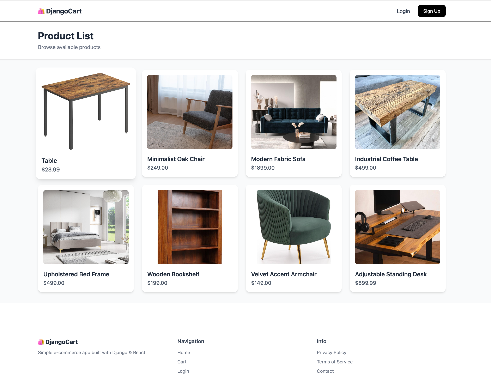
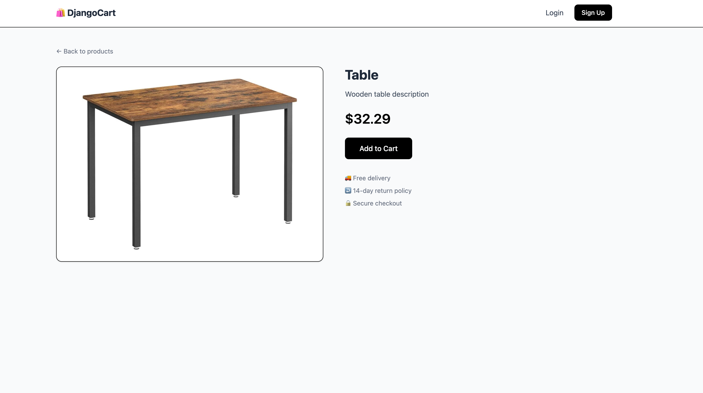
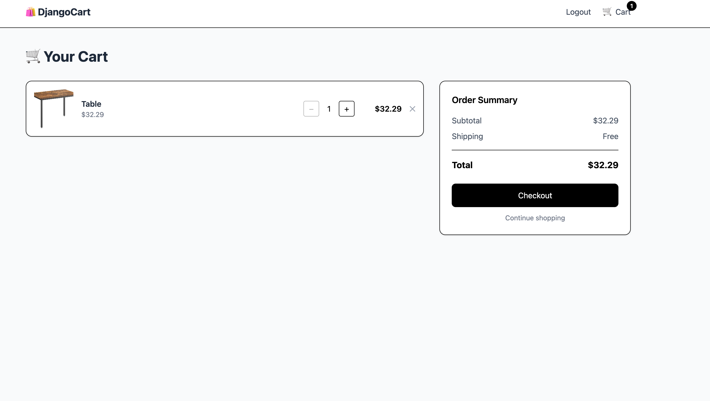

# 🛒 E-commerce Django + React (Vite)

## 🚀 Demo

👉 https://shop.kodario.com

---

## 📸 Preview

### 🏠 Homepage



### 🛍️ Product View



### 🧾 Checkout / Cart



---

## 🧠 Overview

Full-stack e-commerce application built with:

- Django (REST API)
- React (Vite)
- PostgreSQL
- Docker & Docker Compose
- Caddy (reverse proxy + HTTPS)

The project demonstrates a clean separation between frontend and backend, production-ready containerization, and scalable architecture.

---

## 🏗️ Architecture

- **Frontend**
  - React + Vite
  - Built into static files (`dist`)
  - Served by Caddy

- **Backend**
  - Django + Django REST Framework
  - Handles API, authentication, admin panel
  - Connected to PostgreSQL

- **Reverse Proxy**
  - Caddy routes traffic:
    - `/api/*` → Django backend
    - `/api/admin/*` → Django admin
    - `/` → React frontend

- **Static & Media**
  - Stored in Docker volumes
  - Served directly by Caddy (no Django bottleneck)

---

## ⚙️ Tech Stack

- **Backend:** Django, DRF, PostgreSQL
- **Frontend:** React, Vite
- **Infra:** Docker, Docker Compose
- **Proxy:** Caddy
- **Other:** REST API, authentication

---

## 📦 Key Features

- Product listing & details
- Cart & checkout flow
- Authentication (login/signup)
- Django admin panel
- REST API architecture
- Production-ready Docker setup

---

## 🐳 Running the project

```bash
docker compose up -d --build
```

---

## 📁 Project Structure

```
backend/    → Django app (API + admin)
frontend/   → React app (Vite)
docs/       → screenshots
```

---

## 💡 Notes

- Frontend is served as static files (no dev server in production)
- Backend is exposed only via reverse proxy
- Designed for easy scaling and multi-app hosting on a single VPS

---

## 📄 License

MIT
